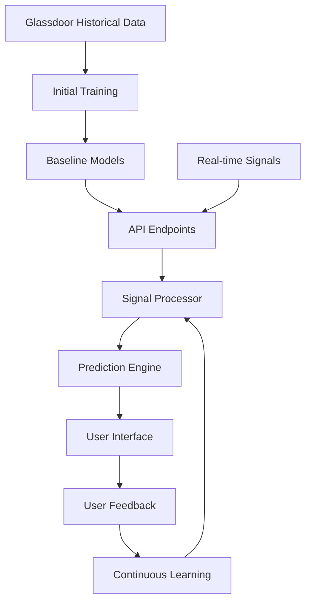

# Data Pipeline & Training Strategy

## 1. Data Sources Integration Order

### Phase 1: Historical Data Processing (Before API Endpoints)
1. **Glassdoor Data Processing**
   - Process raw Glassdoor files:
     - `Glassdoor_Job_Postings.csv`: Historical job posting patterns
     - `glassdoor_company.csv`: Company profiles and metadata
     - `glassdoor_reviews.csv`: Employee sentiment and company culture
   - Create initial training datasets for:
     - Company hiring patterns
     - Industry-specific trends
     - Sentiment baselines

2. **Feature Engineering**
   - Extract key features:
     - Job posting frequency patterns
     - Company growth indicators
     - Industry-specific hiring cycles
     - Sentiment trends
   - Create normalized feature sets

3. **Initial Model Training**
   - Train baseline models on historical data
   - Establish initial weights for signal patterns
   - Create industry-specific benchmarks

### Phase 2: API Integration & Real-time Processing
1. **API Endpoint Setup**
   - Implement FastAPI endpoints
   - Set up WebSocket connections
   - Configure rate limiting and caching

2. **Real-time Signal Processing**
   - Perplexity API integration
   - Sentiment analysis pipeline
   - Signal correlation engine

### Phase 3: Continuous Learning
1. **Feedback Loop Integration**
   - User validation collection
   - Signal weight adjustment
   - Pattern refinement

2. **Model Retraining**
   - Weekly model updates with new data
   - Performance monitoring
   - Accuracy tracking

## 2. Data Flow Architecture

## 3. Implementation Timeline

1. **Week 1: Historical Data Processing**
   - Process Glassdoor datasets
   - Create initial models
   - Set up baseline metrics

2. **Week 2: API Integration**
   - Implement FastAPI endpoints
   - Set up real-time processing
   - Integration testing

3. **Week 3: UI Development**
   - Dashboard implementation
   - Real-time updates
   - User feedback collection

4. **Week 4: Refinement**
   - System optimization
   - Model retraining pipeline
   - Documentation

## 4. Success Metrics

1. **Model Performance**
   - Initial accuracy on historical data
   - Real-time prediction accuracy
   - Signal correlation strength

2. **System Performance**
   - API response times
   - Processing latency
   - Resource utilization

3. **User Engagement**
   - Feedback collection rate
   - Model improvement over time
   - User satisfaction metrics
