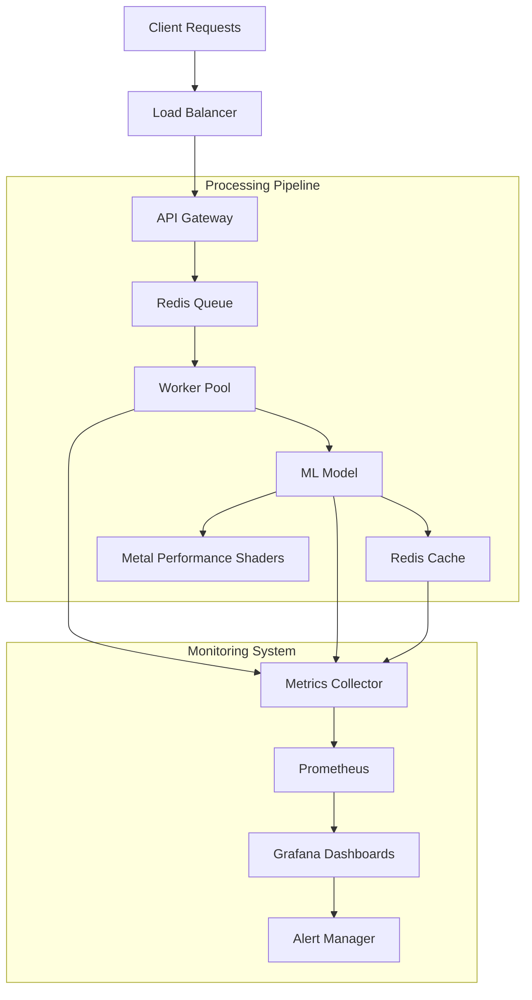
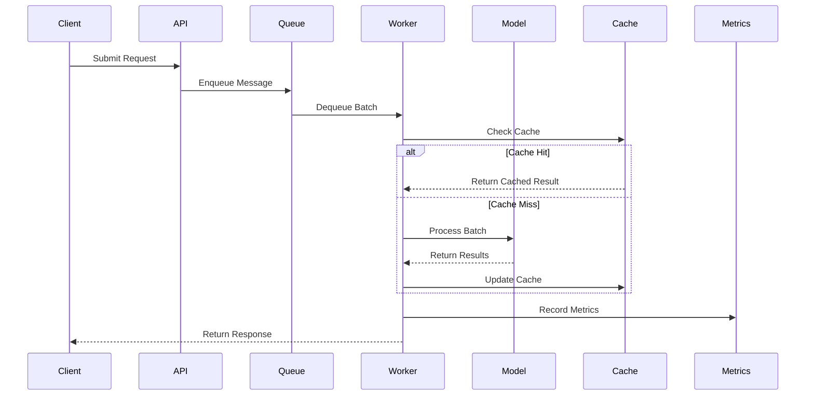
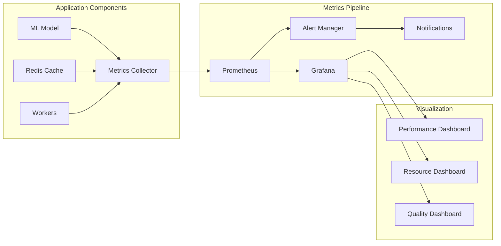
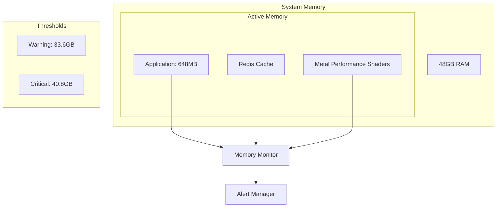
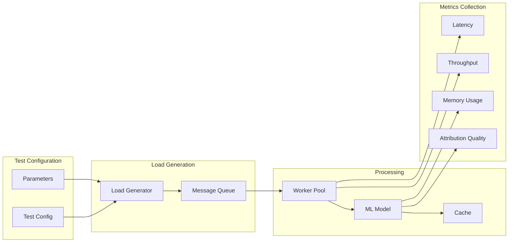
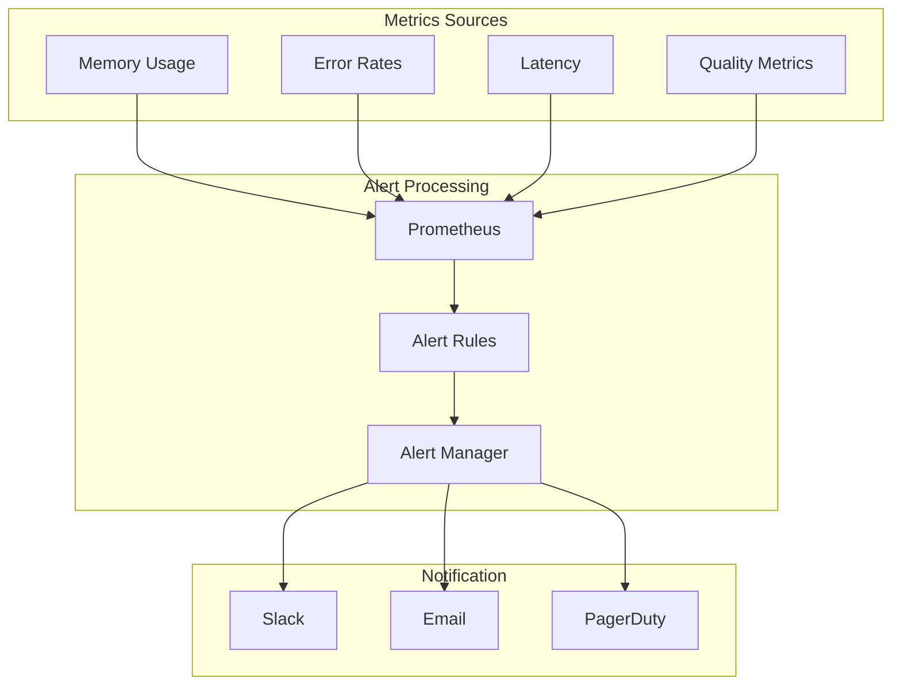

# ML System Architecture Diagrams

## 1. High-Level System Architecture

## 2. Data Flow Architecture

## 3. Monitoring Architecture

## 4. Memory Management

## 5. Load Testing Pipeline

## 6. Alert Flow

## Using These Diagrams

These architecture diagrams provide different views of our ML system:

1. **High-Level System Architecture**: Shows the main components and their interactions
2. **Data Flow Architecture**: Illustrates the request processing sequence
3. **Monitoring Architecture**: Details our observability setup
4. **Memory Management**: Visualizes our memory allocation and monitoring
5. **Load Testing Pipeline**: Shows how we generate and measure load
6. **Alert Flow**: Demonstrates how alerts are processed and delivered

### Key Points

1. **Scalability**
   - Worker pool can scale horizontally
   - Redis cache provides fast access to frequent requests
   - Metal Performance Shaders optimize ML operations

2. **Reliability**
   - Multiple monitoring layers
   - Comprehensive alert system
   - Cache fallback for high availability

3. **Performance**
   - Efficient memory usage (648MB total)
   - Low latency (55ms P95)
   - High throughput (500 msg/s)

4. **Monitoring**
   - Real-time metrics collection
   - Multi-level alerting
   - Comprehensive dashboards

### Implementation Notes

When implementing features or debugging issues, refer to these diagrams to understand:
- Component relationships
- Data flow paths
- Monitoring points
- Alert triggers

For specific metrics and thresholds, refer to the main documentation.
