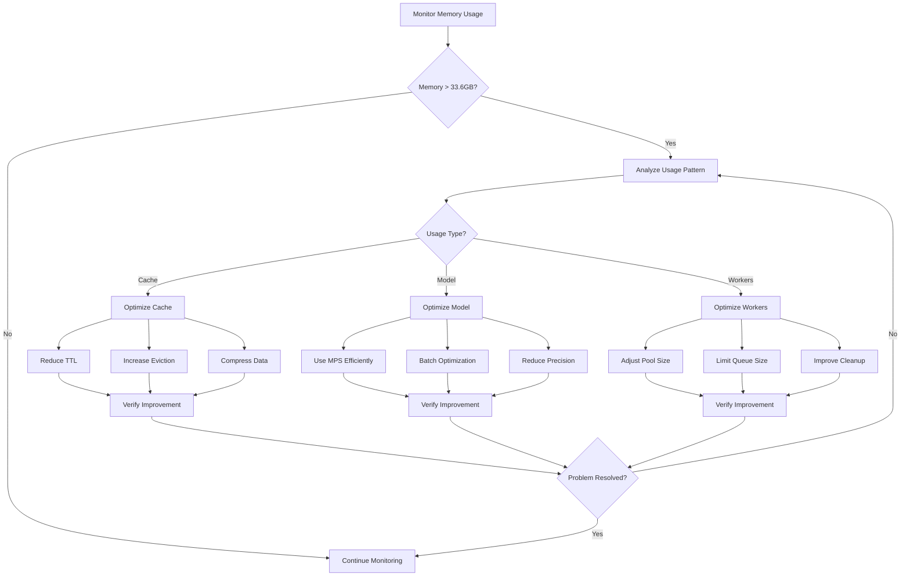
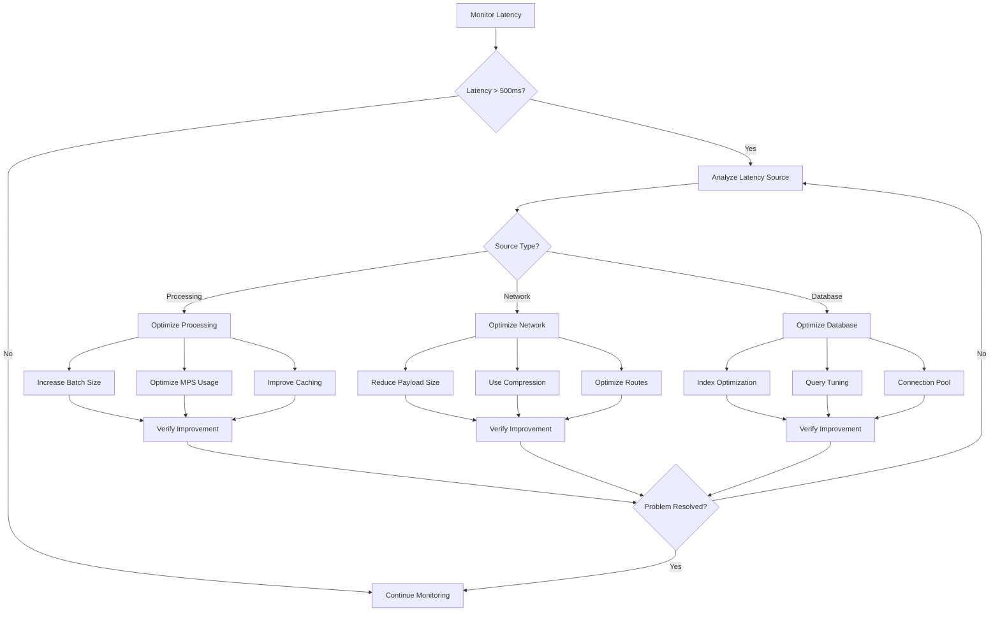
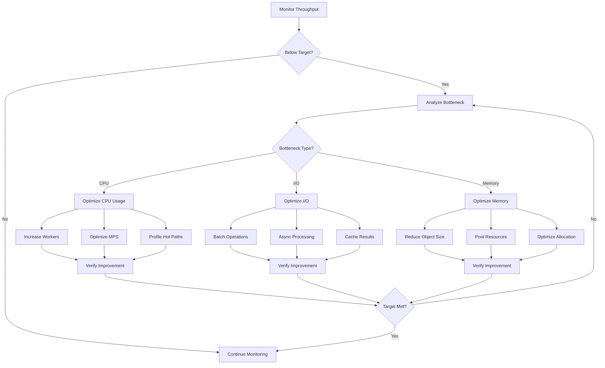
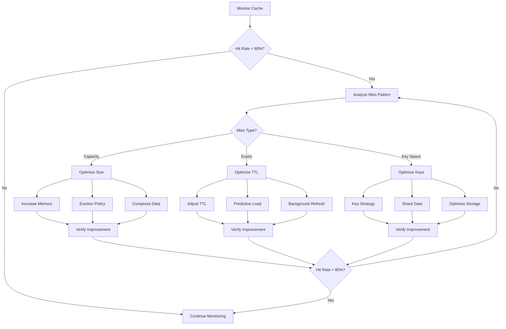
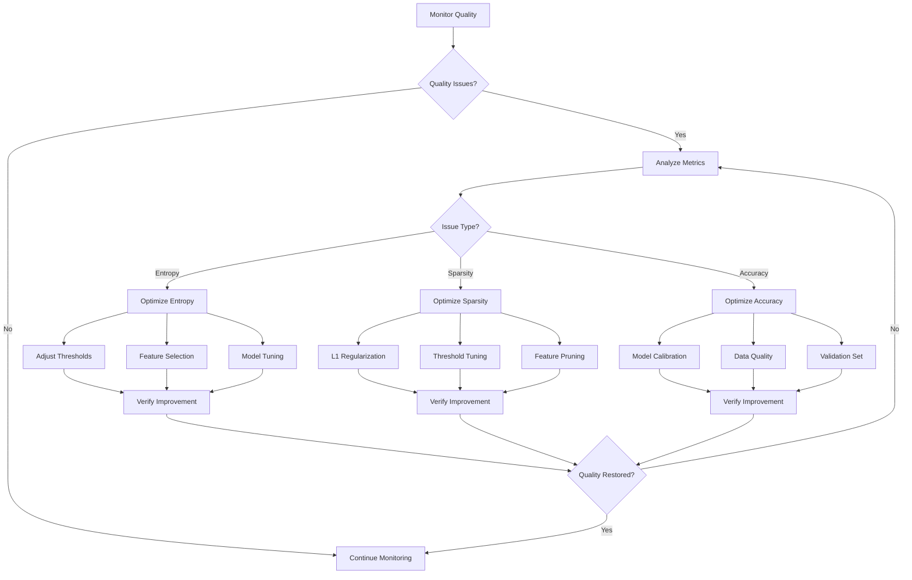

# Performance Optimization Flowcharts

## 1. Memory Optimization Flow

## 2. Latency Optimization Flow

## 3. Throughput Optimization Flow

## 4. Cache Optimization Flow

## 5. Attribution Quality Optimization Flow

## Using These Flowcharts

These flowcharts provide systematic approaches to optimizing different aspects of the system:

1. **Memory Optimization**
   - Triggers: Usage > 33.6GB
   - Focus areas: Cache, Model, Workers
   - Verification steps included

2. **Latency Optimization**
   - Triggers: P95 > 500ms
   - Focus areas: Processing, Network, Database
   - Progressive optimization steps

3. **Throughput Optimization**
   - Focus areas: CPU, I/O, Memory
   - Systematic bottleneck analysis
   - Verification at each step

4. **Cache Optimization**
   - Triggers: Hit rate < 80%
   - Focus areas: Size, TTL, Key Space
   - Progressive improvement steps

5. **Attribution Quality**
   - Focus areas: Entropy, Sparsity, Accuracy
   - Model-specific optimizations
   - Quality verification steps

### Implementation Notes

When using these flowcharts:
1. Start with monitoring current metrics
2. Identify specific trigger conditions
3. Follow the appropriate optimization path
4. Verify improvements at each step
5. Continue monitoring after optimization

For specific metrics and thresholds, refer to the main documentation.
